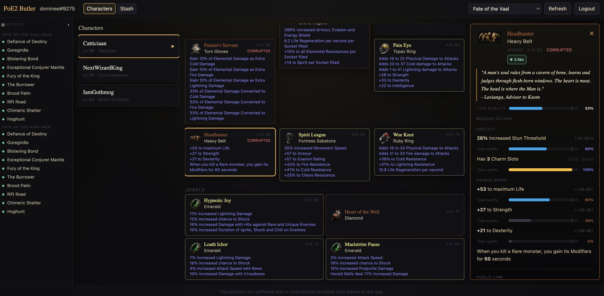
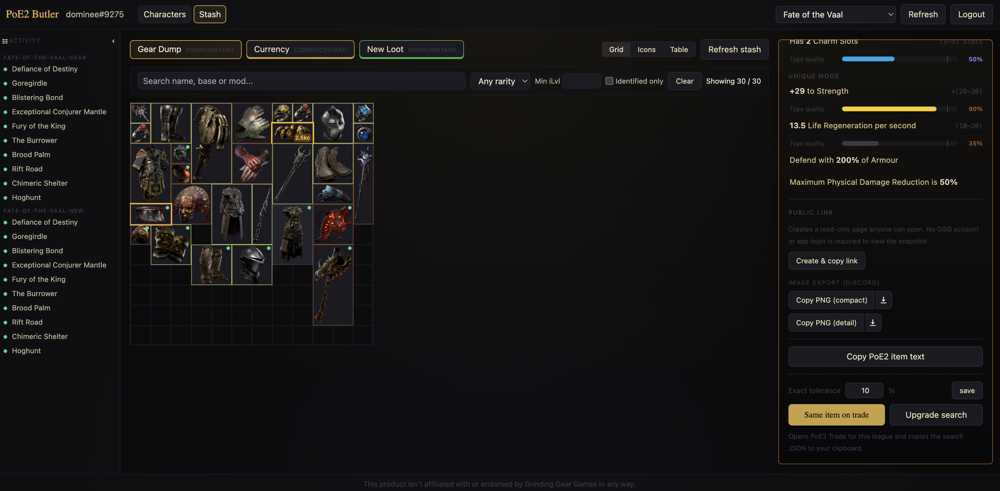

# PoE2 Hideout Butler

> *"Think of it as your personal PoE2 Hideout Butler who takes care of your gear and stash."*

A web application that lets **Path of Exile 2** players pair their GGG account via OAuth2, then browse their characters, equipped gear, and stash tabs online with enriched item information, price estimates, and one-click deep-links to the official trade site.





## Features

- Sign in with your GGG account (OAuth2 + PKCE).
- Browse characters per league and inspect equipped gear in a paper-doll view.
- Browse stash tabs (including currency and other special tab types) in an in-game-like grid or as a virtualised table.
- Click any item to open a detail pane with the full mod list, requirements, sockets/runes, source, and actions.
- Generate PoE2 Trade search links for **the same item** (configurable stat tolerance, default &plusmn;10%) and for **upgrades** (min = current &times; 0.95, no max).
- Price estimates via cached 3rd-party data (poe.ninja), with optional "valuable dump" highlighting for offline price-checks.

## Stack

| Layer | Choice |
|---|---|
| Frontend | React 18 + Vite + TypeScript, Tailwind CSS, TanStack Query, Zustand |
| Backend | Python 3.12, FastAPI, `uv`, Alembic, `arq`, `httpx`, pydantic v2 |
| Storage | PostgreSQL 16 + Redis 7 |
| Edge | Traefik v3; production TLS via **Cloudflare Origin CA** on the origin behind Cloudflare (see [DEPLOY.md](DEPLOY.md)) |
| Tests | `pytest`, Vitest, Playwright |

## Repository layout

```text
backend/      FastAPI app, domain models, GGG + poe.ninja clients
frontend/     React SPA
admin/        Separate FastAPI + Jinja2 admin console (observability; port 8001)
mock-ggg/     Local mock of GGG OAuth2 + API for development and tests
deploy/       docker-compose (dev, **uat**, prod), Traefik, env templates (e.g. `.env.uat.example` for UAT)
docs/         Supplementary docs referenced by the top-level MDs
```

## Quick start (development)

```bash
cp deploy/env/.env.example deploy/env/.env.dev
# Edit deploy/env/.env.dev so browser-facing URLs match the hostnames below
docker compose -f deploy/compose/docker-compose.dev.yml --env-file deploy/env/.env.dev up --build
```

Traefik (`deploy/compose/traefik/dynamic.dev.yml`) routes by **hostname** to each service. The default dev hostnames are:

| Service   | URL |
|-----------|-----|
| SPA (Vite) | <http://app.dev.hideoutbutler.com> |
| API       | <http://api.dev.hideoutbutler.com> |
| Admin     | <http://admin.dev.hideoutbutler.com> |
| Mock GGG  | <http://ggg.dev.hideoutbutler.com> |
| Traefik dashboard | <http://localhost:8080> |

Point those names at your machine (for example wildcard DNS `*.dev.hideoutbutler.com` → `127.0.0.1`, or individual `/etc/hosts` lines). In `.env.dev`, keep **`APP_BASE_URL`**, **`API_BASE_URL`**, **`CORS_ALLOW_ORIGINS`**, **`GGG_OAUTH_AUTHORIZE_BASE_URL`**, **`GGG_REDIRECT_URI`**, and related values consistent with those hosts (see [AGENTS.md](AGENTS.md) — especially **Environments** and **Environment variables**).

The Vite dev server allows the app hostname via **`server.allowedHosts`** in `frontend/vite.config.ts`; set **`VITE_ALLOWED_HOSTS`** (comma-separated) if you introduce another dev hostname. The admin app serves HTML under **`/admin/`**; a request to **`/`** on the admin host redirects there.

OAuth in dev is configured so the browser hits the mock GGG host above while the backend talks to `mock-ggg` inside Docker; see [GGG_API.md](GGG_API.md).

## Production domain

Public deployment uses **`hideoutbutler.com`**: SPA at `https://app.hideoutbutler.com`, API (and GGG OAuth callback) at `https://api.hideoutbutler.com`, admin at `https://admin.hideoutbutler.com`. See [GGG_API.md](GGG_API.md) for OAuth redirect URIs.

**UAT** (optional): a third stack, `deploy/compose/docker-compose.uat.yml`, uses **mock GGG** like dev but **HTTPS** to the origin with a **Cloudflare Origin CA** certificate (same `certs/` filenames as prod; include `*.uat.hideoutbutler.com` on the cert). Copy `deploy/env/.env.uat.example` to `deploy/env/.env.uat`, then see [DEPLOY.md](DEPLOY.md) §4.6 and [AGENTS.md](AGENTS.md) §4.3.

## CI workflow

GitHub Actions runs on push/PR to `main` via `.github/workflows/ci.yml`.

- Python services (`backend`, `admin`, `mock-ggg`) use `uv` with Ruff and pytest.
- Frontend uses Node 22 and caches `~/.npm` via `actions/cache` keyed by `frontend/package.json`.
- Frontend lint and dependency audits are currently non-blocking (`|| true`) to keep CI informative while avoiding hard-failures on advisory-only checks.

## Local test checklist (before push)

Run local tests before pushing so CI failures are caught earlier.

```bash
# Backend lint + tests
uv run --project backend ruff check backend/app backend/tests
uv run --project backend pytest backend/tests -q
```

```bash
# Admin lint + tests
uv run --project admin ruff check admin/app admin/tests
uv run --project admin pytest admin/tests -q
```

```bash
# Frontend unit tests (native, when npm is installed)
cd frontend
npm test
```

```bash
# Frontend unit tests (Docker fallback; useful when npm is unavailable locally)
docker run --rm \
  -v "$PWD:/work" \
  -w /work/frontend \
  node:22 \
  bash -lc "npm test"
```

`npm test` runs Vitest unit tests only (E2E specs in `frontend/e2e/` are excluded). Run Playwright separately when the dev stack is up:

```bash
cd frontend
npm run test:e2e
```

## Documentation

- [AGENTS.md](AGENTS.md) — context for AI agents contributing to the project.
- [GGG_API.md](GGG_API.md) — GGG OAuth2 setup, scopes, rate-limits.
- [DEPLOY.md](DEPLOY.md) — build and deploy procedure.
- [SECURITY.md](SECURITY.md) — cross-cutting security checklist.
- [docs/BOT_API.md](docs/BOT_API.md) — frozen contract for external API consumers (e.g. Discord bot).
- [docs/openapi.json](docs/openapi.json) — pinned OpenAPI 3.1 schema.

## License

See [LICENSE](LICENSE).
